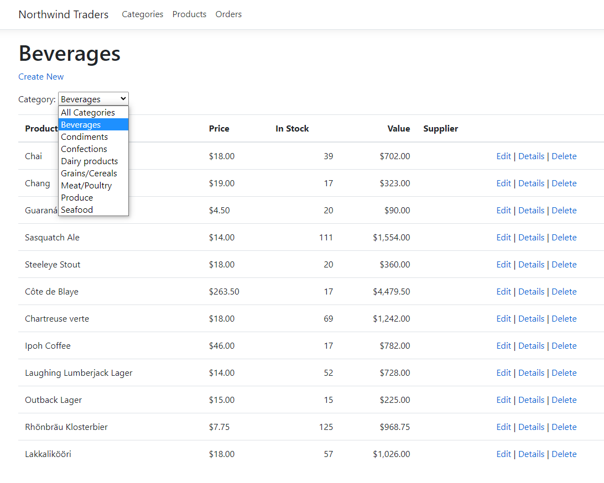

# Northwind Traders
ASP.NET Web-App that manages orders, products, customers, suppliers, and many other aspects of a small business.

This program requires the northwind database, than connecting to it and retrieves data to be displayed that can be modified by the user which includes Creating, Editing, Deleting, and filtering data that is outputted from the database.

# Requirements
- Microsoft SQL Server
- Create a database, using the SQL code that can be found in the SQL folder
- Run without debug mode in Visual Studio

